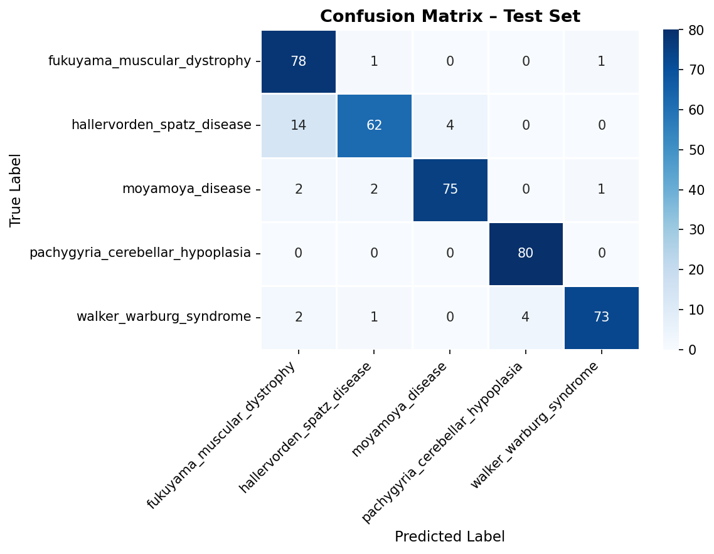
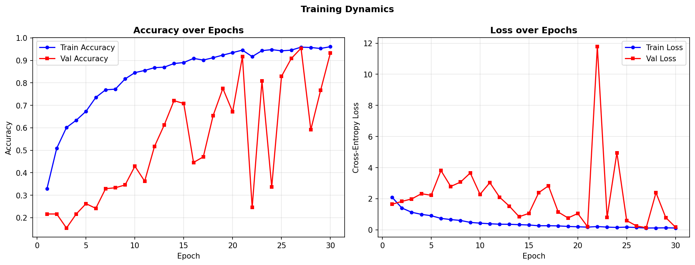
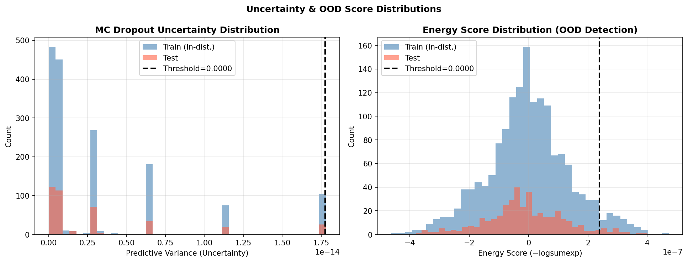
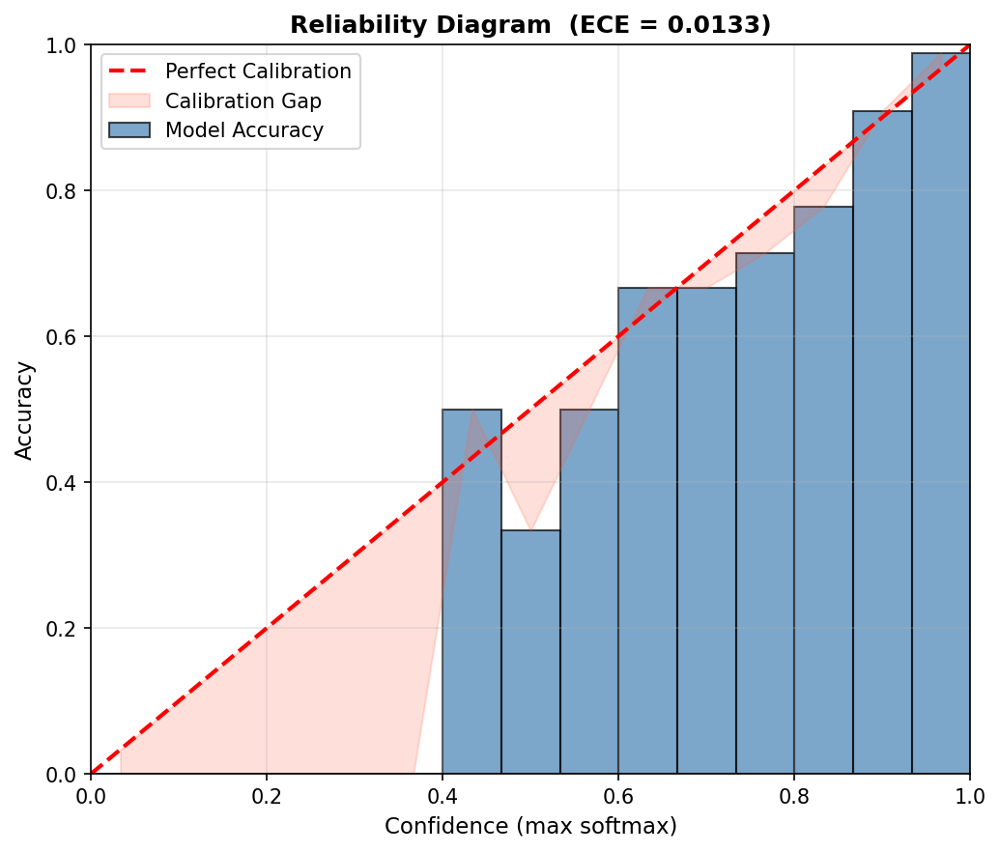

# 🧠 Reliable Neural Network Framework for Uncertainty Estimation & OOD Detection

## 📌 Overview

This repository presents a **robust deep learning framework** designed to address the critical issue of **overconfidence in neural networks**, particularly in **medical imaging applications**.

The framework integrates:

* **EfficientNetB0** (transfer learning backbone)
* **Monte Carlo Dropout** (predictive uncertainty estimation)
* **Energy-based scoring** (out-of-distribution detection)
* **Autoencoder reconstruction error** (structural anomaly detection)

The system ensures that **uncertain or unreliable predictions are flagged and referred**, rather than being blindly trusted — a crucial requirement in safety-critical domains like healthcare.

---

## 🧠 Problem Statement

Modern neural networks often produce **high-confidence predictions even on unfamiliar or unseen data**, leading to:

* Misleading outputs
* Silent failures under distribution shift
* Reduced reliability in real-world deployment

In medical diagnosis, such failures can directly impact decision-making and patient safety.

---

## 🚀 Proposed Solution

We propose a **triage-based framework** that combines three complementary signals:

| Signal              | Purpose                            |
| ------------------- | ---------------------------------- |
| MC Dropout Variance | Captures model uncertainty         |
| Energy Score        | Detects out-of-distribution inputs |
| Autoencoder Error   | Identifies structural anomalies    |

### 🔍 Decision Logic

If any of the signals exceeds its threshold:

→ **Refer to human expert**

Else:

→ **Return model prediction**

---

## 🏗️ System Architecture

MRI Image
↓
Preprocessing (CLAHE + Z-Normalization)
↓
EfficientNetB0 (Feature Extraction)
↓
MC Dropout (T = 20 forward passes)
↓
Energy Score + Predictive Variance
↓
Autoencoder Reconstruction
↓
Triage Decision System
↓
Final Output → *Classify OR Refer*

---

## 📂 Dataset

* Source: Kaggle (Rare Neurological Diseases MRI Dataset)
* Total Images: **2000**
* Classes: **5 (balanced)**

| Class                            | Images |
| -------------------------------- | ------ |
| Fukuyama Muscular Dystrophy      | 400    |
| Hallervorden-Spatz Disease       | 400    |
| Moyamoya Disease                 | 400    |
| Pachygyria Cerebellar Hypoplasia | 400    |
| Walker-Warburg Syndrome          | 400    |

* Train/Test Split: **80/20 (Stratified)**

---

## ⚙️ Preprocessing

* CLAHE (Contrast enhancement)
* Z-normalization
* Data augmentation:

  * Rotation
  * Horizontal flip
  * Zoom
  * Contrast variation

---

## 🧩 Methodology

### 🔹 1. Backbone Model

* EfficientNetB0 pretrained on ImageNet
* Transfer learning for feature extraction

### 🔹 2. Monte Carlo Dropout

* Dropout active during inference
* 20 stochastic forward passes
* Outputs:

  * Predictive Mean
  * Predictive Variance

### 🔹 3. Energy-Based OOD Detection

* Uses raw logits
* High energy → potential distribution shift

### 🔹 4. Autoencoder

* Learns in-distribution patterns
* High reconstruction error → anomaly

### 🔹 5. Triage Framework

* OR-based decision system
* Ensures conservative and safe predictions

---

## 📊 Results

### 🔹 Performance Metrics

* Accuracy: **95%**
* AUC-ROC: **0.9952**
* Precision: **0.9571**
* Recall: **0.9475**
* Expected Calibration Error (ECE): **0.0133**

### 🔹 Key Observations

* Strong calibration (reliable confidence scores)
* Effective uncertainty detection
* Robust OOD separation
* Minor confusion between structurally similar classes

---

## 📈 Visualizations

### 🔹 Confusion Matrix



### 🔹 Training Performance



### 🔹 Uncertainty & OOD Distribution



### 🔹 Reliability Diagram (Calibration)



---

## 🧪 How to Run

### 1. Clone Repository

```
git clone https://github.com/your-username/your-repo-name.git
cd your-repo-name
```

### 2. Install Dependencies

```
pip install -r requirements.txt
```

### 3. Run Notebook

```
jupyter notebook
```

Open:

```
notebooks/main_code.ipynb
```

---

## 📁 Project Structure

```
├── notebooks/
│   └── main_code.ipynb
│
├── results/
│   ├── fig1_class_distribution.png
│   ├── fig2_training_history.png
│   ├── fig3_confusion_matrix.png
│   ├── fig4_uncertainty_ood.png
│   ├── fig5_reliability_diagram.png
│   └── fig6_pipeline_diagram.png
│
├── paper/
│   └── final_paper.pdf
│
├── README.md
└── .gitignore
```

---

## ⚠️ Limitations

* Limited dataset size → mild overfitting
* Fixed thresholds (dataset-dependent)
* Autoencoder limited to pixel-level anomaly detection

---

## 🔮 Future Work

* Cross-validation for robustness
* External OOD dataset evaluation
* Grad-CAM visual explanations
* Multi-modal MRI integration

---

## 👨‍💻 Authors

* Ishika
* Aadya Chaturvedi
* Kanak Sharma

---

## 📜 License

This project is intended for **academic and research purposes only**.

---

## ⭐ Acknowledgements

* Kaggle dataset contributors
* Referenced research papers in uncertainty estimation and OOD detection

---
